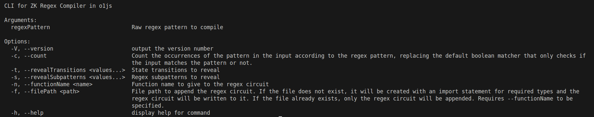
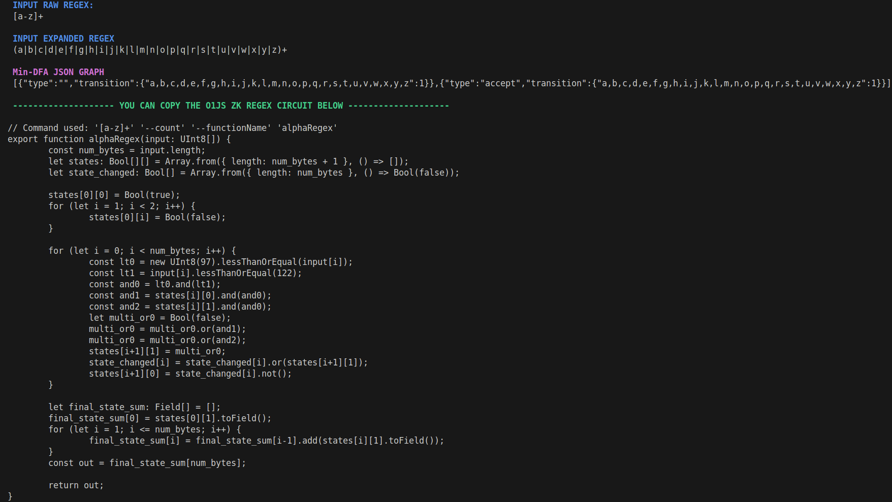
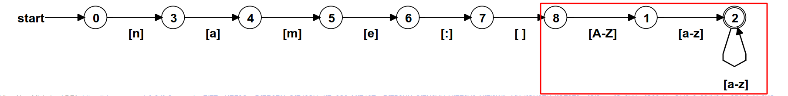
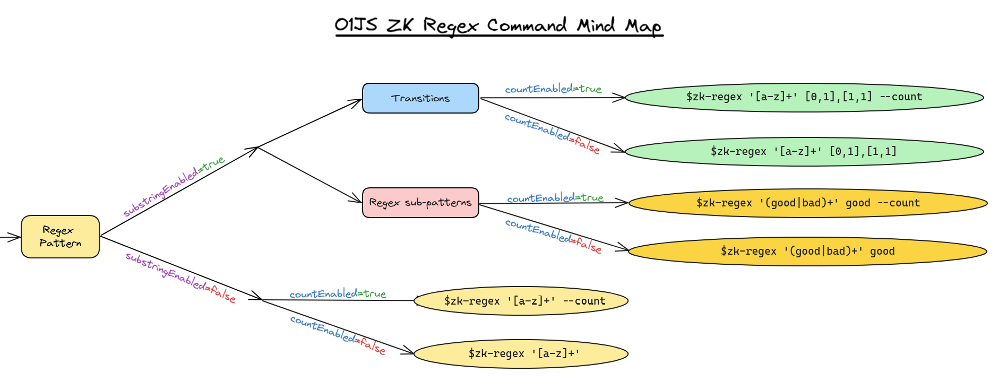
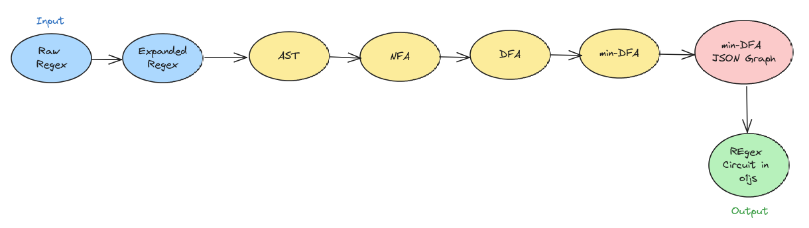

## Description

This library compiles zk-regex circuits in [o1js](https://github.com/o1-labs/o1js) to prove/verify zero-knowledge regular expressions on the Mina blockchain.

ZK Regex represents a groundbreaking advancement in zero-knowledge proof (ZKP) technology, enabling the verification of text data within a ZKP framework.

Traditionally, ZK proofs have been utilized to verify knowledge of field elements within circuits, but ZK Regex expands this capability to encompass the validation of string data, or bytes, against a specified expression.

The innovation was originally developed for [zk-email-verify](https://github.com/zkemail/zk-email-verify), but it has far-reaching implications beyond zk-email validation, extending to various applications that require private text verification on the blockchain.

By leveraging ZK Regex, developers can securely verify the presence of specific text patterns without compromising data privacy, opening the door to a wide range of use cases such as secure messaging, confidential document validation, and more.

## How to install the CLI

```sh
npm install -g zk-regex-o1js
```

## How to confirm successful installation:

```sh
zk-regex --version
```

or

```sh
zkr --version
```

### How to update the ZK Regex CLI

```sh
npm update -g zk-regex-o1js
```

## How to display help

```sh
zk-regex --help
```



## How to use CLI to write or append o1js regex circuits directly into a TS File

Start by providing a raw regex pattern and specifying the `--filePath` option:

```sh
zk-regex <regexPattern> [options] --filePath <path> --functionName <name>
```

- **Note:** When using the `--filePath` option, you must also provide the `--functionName` option. This ensures that the compiled regex circuit is given a specific function name within the TypeScript file.

### File Handling:

- If the _file_ specified by `--filePath` does not exist:
  - The CLI will create the file.
  - An import statement for the required types (`Bool`, `Field`, `UInt8` from `o1js`) will be added at the top of the file.
  - The compiled regex circuit will be written to the file.
- If the file specified by --filePath exists:
  - The compiled regex circuit will be appended to the existing file.

### Example Command:

```sh
zk-regex '(a|b)c' --functionName myRegexFunction --filePath ./src/regexCircuits.ts
```

This command will append the compiled regex circuit for the pattern `(a|b)c `to `./src/regexCircuits.ts` with the function name `myRegexFunction`.

## How to use manually

1. Provide a raw or parsed (expanded) regex pattern along with the desired options as described in the CLI documentation, then execute the following command:

   ```sh
    zk-regex <regexPattern> [options]
   ```

2. In your TypeScript file, import the necessary modules at the top:

   ```typescript
   import { Field, Bool, UInt8 } from 'o1js';
   ```

3. Add the function body and paste your specific ZK Regex circuit code.

   - For examples, refer to the [examples file](./src/examples.ts) .

4. Import the function and integrate it into your zkApp.

---

Below is a screenshot depicting how a ZK Regex circuit in `o1js` appears upon successful compilation:



---

## Compiler Options

1.  `--count`: A boolean option that is set to **false** by default.

    - If `--count` is not used, the compiled circuit will have a **Bool** output, signifying whether the input matches the regex pattern.

      - Example: For a regex `Hello [a-z]+!`, the input `Hello world!` will return `Bool(true)`, whereas the input `Hello there` will return `Bool(false)` because the exclamation mark `!` is missing at the end of the input.

    - If `--count` is used, the compiled circuit will return a **Field** output, signifying the number of matching patterns according to the regex.
      - Example: For a regex `[0-9]+`, the input `I saw 279 ants and 1 elephant` will return `Field(4)` because it contains 4 numbers. Whereas an input like `Cheese` will return `Field(0)` because there are no digits in the input, which can also invalidate the input like `Bool(false)`.

2.  For a defined regex, there are two alternative variadic options to reveal its substring patterns: `--revealTransitions` and `--revealSubpatterns`.

    - **Warning** Only one of these options can be used at a time. Using both will result in an error, as they are mutually exclusive choices for revealing patterns.

    - If neither reveal option is used, the compiled circuit will return either `Field` or `Bool` output based on the `--count` option. This means the regex circuit will only validate the input without revealing any sub-patterns.

    - If one of the reveal options is used, the compiled circuit will reveal parts of the input based on the specified regex sub-pattern(s) or the provided min-DFA transitions.

    - **Notes:**

      - The reveal substring feature is particularly useful for occurrence matching with the `+` (one or more) operator. This feature allows for meaningful use cases in various circuits by fetching the matching values. For instance, it can be used to match and reveal a series of base64 characters or to extract an abstract number from a match like `[0-9]+`.
      - While matching specific patterns such as `white` or `Human` might seem less practical, these examples are provided to illustrate how to effectively use the reveal options.

    - **Sub-patterns:** `--revealSubpatterns` or `-s`

      - Sub-patterns refer to specific parts of the regex input that are parsed to extract and reveal their respective transitions.

      - **Warning:** The compiler will throw an error if a sub-pattern is not included in the entire regex or if the specified sub-pattern does not match the correct type.

      - **Example:** For the command `zk-regex '(Human|Robot)+' --revealSubpatterns Human`, `Human` is a valid sub-pattern within the regex `(Human|Robot)+`. However, the compiler will raise an error if the sub-pattern specified is not present in the main regex or if it does not match, such as using `Humanoid` or `human` instead of `Human`.

      - Additionally, sub-patterns can be specified separately for more flexibility. For example, using `zk-regex '(Human|Robot)+' --revealSubpatterns Human Robot` allows you to reveal specific sub-patterns, as opposed to revealing everything attached with `zk-regex '(Human|Robot)' --revealSubpatterns '(Human|Robot)'`.

      - When using the `--revealSubpatterns` option, the output of the circuit includes a key to respect the scattering of revealed sub-patterns.

      - In practice, if you reveal a single sub-pattern, you can access it with `reveal[0]` within the zkApp when using the regex circuit.

    - **Transitions:** `--revealTransitions` or `-t`

      - Transitions represent the underlying raw inputs used to reveal substrings in a regex match.

      - The `--revealTransitions` option in the CLI allows you to specify a variadic list of transition pairs in a special format.

        - **Example Command:** `zk-regex [a-z]+ --revealTransitions [0,1],[1,1]`

      - **Warning:**

        - The compiler will issue a warning if you provide a transition array that contains pairs not included in the full regex transition.
        - The warning will occur if the format of the transitions does not match `[number, number],[number, number],...`.

      - For greater flexibility, similar to subpatterns, you can specify multiple series of transition pairs, such as `[0,1],[1,1] [2,3],[3,4]`.

      - Working with transitions can be more straightforward if you understand the DFA (Deterministic Finite Automaton) visualization. Otherwise, it is recommended to use sub-patterns for ease of use.

### Enabling Substring Walkthrough

- Following the regex pattern `name: [A-Z][a-z]+`:

  - This regex signifies an input string that starts with `name`, `:`, and a whitespace.
  - It then takes a name that starts with **one** capital alphabetic letter and then **one or more** lowercase alphabetic letters.

- In this example, we want to reveal the dynamic substring knowing that it's abstract given the repetition pattern.

- Entering the **sub-pattern** is quite straightforward, and giving the input `[A-Z][a-z]+` solves the issue easily.

  - Command: `zk-regex 'name: [A-Z][a-z]+' -s [A-Z][a-z]+`

- As with transitions, you should first use this amazing [min-DFA visualizer](https://zkregex.com/min_dfa?regex=bmFtZTogKEF8QnxDfER8RXxGfEd8SHxJfEp8S3xMfE18TnxPfFB8UXxSfFN8VHxVfFZ8V3xYfFl8WikoYXxifGN8ZHxlfGZ8Z3xofGl8anxrfGx8bXxufG98cHxxfHJ8c3x0fHV8dnx3fHh8eXx6KSs=)
  

- You can see in the graph above that the transitions containing the inputs `[A-Z]` and `[a-z]+` are `8 to 1`, `1 to 2`, and `2 to 2`.
  - Hence the transitions input `[8,1],[1,2],[2,2]` also reveals the name starting with a capital letter.
  - Command: `zk-regex 'name: [A-Z][a-z]+' -t [8,1],[1,2],[2,2]`
  - **NOTE:** Separation is also possible by reorganizing the transitions sub-array, such as `[8,1] [1,2],[2,2]`, which reveals the first capital letter and the rest lowercase letters separately.

### Options Graph



## How to build

```sh
npm run build
```

## How to run tests

```sh
npm run test
npm run testw # watch mode
```

## How to run coverage

```sh
npm run coverage
```

## How to run zkApp example

```sh
npm run zkapp
```

## Raw Regex Syntax Guide

- **Alteration:** The `|` character can be used to denote alternation between two expressions. For example: `A|B`.
- **Concatenation:** Expressions can be concatenated together to form a new expression. For example: `ABC`.
- **One or More:** The `+` character can be used to indicate that the preceding expression must occur one or more times. For example: `A+`.
- **Grouping:** Allows treating multiple characters or patterns as a single unit. This is useful for applying quantifiers or operators to multiple characters or patterns at once. For example, `(ab)+` would match one or more occurrences of the sequence `ab`.
- **ORing (Character/Number Classes):** Expressions can be ORed together using brackets and the `|` character to form character or number classes. For example: `(four|4)`.
- **Ranges:** Ranges of characters or numbers can be defined using brackets and the `-` character. For example: `[0-9]` or `[a-z]`.
  - Specific ranges of digits or alphabets are supported, such as `[D-S]` or `[4-8]`.
  - It is also possible to combine ranges within the same brackets, for example, `[f-sA-N6-8]`.
- **Negation**: The `^` character can be used to negate characters or ranges within character classes. For example, `[^aeiou]` matches any character that is not a vowel.
- **Repetition:** The `{m}` syntax allows you to specify that a character or group must appear exactly `m` times.

  - For example, `a{3}` matches exactly three `a` characters in a row, so it would match `aaa` but not `aa` or `aaaa`.
  - `\d{3}` matches exactly three digits, such as `123` or `456`.

- **Meta Character Support**:
  - `\w`: ANY ONE word character. For ASCII, word characters are `[a-zA-Z0-9_]`
  - `\W`: ANY ONE **non**-word character. For ASCII, word characters are `[a-zA-Z0-9_]`
  - `\d`: ANY ONE digit character. Digits are `[0-9]` for digits
  - `\D`: ANY ONE **non**-digit character. Digits are `[0-9]` for digits
  - `\s`: ANY ONE space character. For ASCII, whitespace characters are `[\n\r\t\v\f]`
  - `\S`: ANY ONE **non**-space character. For ASCII, whitespace characters are `[\n\r\t\v\f]`

For more details, you can visit this amazing [ZK Regex Tools](https://zkregex.com/min_dfa) website.

### Limitations

The regular expressions supported by the zk-regex compiler have the following limitations:

- Regular expressions that, when converted to DFA, have multiple accepting states are **not** supported.
- Regular expressions that, when converted to DFA (Deterministic Finite
  Automaton), include transitions to the initial state are **not** supported such as:
  - `*`: zero or more (0+), e.g., [0-9]\* matches zero or more digits. It accepts all those in [0-9]+ plus the empty string.
  - `?`: zero or one (optional), e.g., [+-]? matches an optional "+", "-", or an empty string.
- Laziness or _Curb Greediness for Repetition Operators_ are **not** supported
  - `*?`, `+?`, `??`, `{m,n}?`, `{m,}?`
- Position Anchors (does not match character, but position such as start-of-line, end-of-line, start-of-word and end-of-word) are **not** supported.

## ZK Regex Workflow

- **Raw Regex:** Begin with the raw regular expression provided by the user. This expression may contain shorthand notations, special characters, and other syntactic elements.

- **Expanded Regex:** Expand any shorthand notations or special characters present in the raw regular expression to their full form. For example, convert shorthand classes like \w (word character) to their full representation, such as [a-zA-Z0-9_].

- **AST (Abstract Syntax Tree):** Parse the expanded regular expression into an abstract syntax tree (AST). The AST represents the hierarchical structure of the regular expression, breaking it down into its constituent parts, such as literals, character classes, quantifiers, and operators.

- **NFA (Nondeterministic Finite Automaton):** Convert the AST into a Nondeterministic Finite Automaton (NFA). The NFA is a mathematical model that represents all possible states and transitions of the regular expression. It allows for multiple transitions from a single state on the same input symbol.

- **DFA (Deterministic Finite Automaton):** Convert the NFA into a Deterministic Finite Automaton (DFA) using a suitable algorithm, such as subset construction. The DFA is a simplified version of the NFA, where each state has exactly one transition for each input symbol. This simplification enables efficient pattern matching and evaluation.

- **Min-DFA (Minimal Deterministic Finite Automaton):** Minimize the DFA to produce the Minimal Deterministic Finite Automaton (MinDFA). Minimization removes redundant states and transitions from the DFA while preserving its language recognition capabilities. This results in a more compact representation of the regular expression's language.

- **DFA JSON Serializer:** Serialize the MinDFA into a JSON format for storage, transmission, or further processing. This JSON representation typically includes information about the states, transitions, and other properties of the MinDFA, making it portable and easy to work with in various applications.

- **Compile O1JS Circuit:** The compilation process in `o1js` hinges on the state and edge transitions of the DFA. This process involves constructing a circuit using elementary gates that correspond to these transitions. At each step, the compiler evaluates the current character and state, utilizing a sequence of AND and multi-OR gates to discern the subsequent state.

  

## Theory

- Regular expressions (regex) are powerful tools used in computer science and programming for pattern matching and text manipulation. They provide a concise and flexible way to search, match, and extract specific patterns of characters within strings.

- At the core of regular expressions lie finite automata, which are abstract mathematical models of computation. Two common types of finite automata used in the context of regular expressions are Nondeterministic Finite Automata (NFA) and Deterministic Finite Automata (DFA).

- An NFA is a theoretical model that represents a set of states and transitions between those states based on input symbols. Unlike DFAs, NFAs allow multiple transitions from a single state with the same input symbol and may have ε-transitions (transitions without consuming input). NFAs are often used in the early stages of regex processing due to their flexibility in representing complex patterns.

- On the other hand, a DFA is a more rigid model where each state has exactly one transition for each input symbol, and there are no ε-transitions. While DFAs are less expressive than NFAs, they are more efficient to execute, making them suitable for practical regex implementations.

- The relationship between regular expressions, NFAs, and DFAs lies in their equivalence. It has been proven that any regular expression can be converted into an equivalent NFA and then further into an equivalent DFA. This process, known as the Thompson construction algorithm, transforms a regex into an NFA and then into a DFA without changing the language it represents.

---

- To grasp the theory behind the regex circuit compiler and delve deeper into the analysis of ZK DFAs, please visit [Katat’s blog](https://katat.me/blog/ZK+Regex/).

- Following Katat's recommendation, exploring [Dmitry Soshnikov's blog post](https://dmitrysoshnikov.medium.com/building-a-regexp-machine-part-1-regular-grammars-d4986b585d7e) and other resources can provide a deeper understanding of the theory behind regular expressions.

- This [Theory of Computation & Automata Theory](https://www.youtube.com/playlist?list=PLBlnK6fEyqRgp46KUv4ZY69yXmpwKOIev) YouTube playlist offers comprehensive learning and practice exercises to understand the theory behind regular expressions.

## FSM Tools

- To visually simulate your DFAs, NFAs, and ε-NFAs, explore step-by-step input symbol processing, visit the [FSM simulator](https://ivanzuzak.info/noam/webapps/fsm_simulator/) for an interactive experience.

- For a more precise and compatible zk-regex syntax, visit the [ZK Regex Tools](https://zkregex.com/min_dfa) to expand and visualize DFA states, developed in the same manner as in this repository.

- Since the project is inspired by the ZK Regex **Circom** Circuit Generator, visit this [Visual Circuit Generator](https://tool.zkregex.com/) for a similar experience in understanding how the compiler in o1js functions.

## General Information About Regex

For general information about regex, including syntax support, examples, and usage in programming languages, please visit this [link](https://www3.ntu.edu.sg/home/ehchua/programming/howto/Regexe.html#zz-2).

## Acknowledgment

- A huge thanks to the [zkemail](https://github.com/zkemail) team for their magnificent work on the original [zk-regex](https://github.com/zkemail/zk-regex), which inspired and aided in the development of this project. Their reference materials and documentation were invaluable in understanding the technical intricacies.

- Special thanks to [Gregor Mitscha-Baude](https://twitter.com/mitschabaude) for identifying the inefficiency in processing full field elements. This change significantly improved the efficiency of the o1js-regex circuits.

## License

[Apache-2.0](LICENSE)
