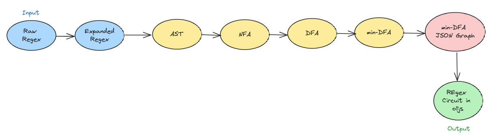

## Description 

This library compiles zk-regex circuits in [o1js](https://github.com/o1-labs/o1js) to prove/verify zero-knowledge regular expressions on the Mina blockchain.

ZK Regex represents a groundbreaking advancement in zero-knowledge proof (ZKP) technology, enabling the verification of text data within a ZKP framework. 

Traditionally, ZK proofs have been utilized to verify knowledge of field elements within circuits, but ZK Regex expands this capability to encompass the validation of string data, or bytes, against a specified expression.

The innovation was originally developed for [zk-email-verify](https://github.com/zkemail/zk-email-verify), but it has far-reaching implications beyond zk-email validation, extending to various applications that require private text verification on the blockchain. 

By leveraging ZK Regex, developers can securely verify the presence of specific text patterns without compromising data privacy, opening the door to a wide range of use cases such as secure messaging, confidential document validation, and more.

## How to use

1. Start by providing a raw or parsed (expanded) regex pattern, then execute the following command:
   ```sh
   npm run zk-regex <input>
   ```

2. In your TypeScript file, import the necessary modules at the top:
   ```typescript
   import { Field , Bool } from 'o1js';
   ```

3. Add the function body and paste your specific ZK Regex circuit code.
   - For examples, refer to the [examples file](./src/examples.ts) .

4. Import the function and integrate it into your zkApp.

---

Below is a screenshot depicting how a ZK Regex circuit in `o1js` appears upon successful compilation:

   


## How to build

```sh
npm run build
```

## How to run tests

```sh
npm run test
npm run testw # watch mode
```

## How to run coverage

```sh
npm run coverage
```

## Raw Regex Syntax Guide

 - **Alteration:** The | character can be used to denote alternation between two expressions. For example: A|B.
 - **Concatenation:** Expressions can be concatenated together to form a new expression. For example: ABC.
 - **One or More:** The + character can be used to indicate that the preceding expression must occur one or more times. For example: A+.
 - **Zero or More:** The * character can be used to indicate that the preceding expression can occur zero or more times. For example: A*.
 - **Optional:** The ? character can be used to indicate that the preceding expression is optional. For example: A?.
    - Note: The optional character is not accepted, as the compiler throws an error stating 'Accept nodes length must be exactly 1'.
 - **ORing (Character/Number Classes):** Expressions can be ORed together using brackets and the | character to form character or number classes. For example: [ABC] or [345].
 - **Ranges:** Ranges of characters or numbers can be defined using brackets and the - character. For example: [0-9] or [a-z].
 - **Grouping:** Allows treating multiple characters or patterns as a single unit. This is useful for applying quantifiers or operators to multiple characters or patterns at once. For example, (ab)+ would match one or more occurrences of the sequence "ab".
 - **Negation**: The ^ character can be used to negate characters or ranges within character classes. For example, [^aeiou] matches any character that is not a vowel.

For more details, you can visit this amazing [ZK Regex Tools](https://zkregex.com/min_dfa) website.


## ZK Regex Workflow

- **Raw Regex:** Begin with the raw regular expression provided by the user. This expression may contain shorthand notations, special characters, and other syntactic elements.

- **Expanded Regex:** Expand any shorthand notations or special characters present in the raw regular expression to their full form. For example, convert shorthand classes like \w (word character) to their full representation, such as [a-zA-Z0-9_].

- **AST (Abstract Syntax Tree):** Parse the expanded regular expression into an abstract syntax tree (AST). The AST represents the hierarchical structure of the regular expression, breaking it down into its constituent parts, such as literals, character classes, quantifiers, and operators.

- **NFA (Nondeterministic Finite Automaton):** Convert the AST into a Nondeterministic Finite Automaton (NFA). The NFA is a mathematical model that represents all possible states and transitions of the regular expression. It allows for multiple transitions from a single state on the same input symbol.

- **DFA (Deterministic Finite Automaton):** Convert the NFA into a Deterministic Finite Automaton (DFA) using a suitable algorithm, such as subset construction. The DFA is a simplified version of the NFA, where each state has exactly one transition for each input symbol. This simplification enables efficient pattern matching and evaluation.

- **Min-DFA (Minimal Deterministic Finite Automaton):** Minimize the DFA to produce the Minimal Deterministic Finite Automaton (MinDFA). Minimization removes redundant states and transitions from the DFA while preserving its language recognition capabilities. This results in a more compact representation of the regular expression's language.

- **DFA JSON Serializer:** Serialize the MinDFA into a JSON format for storage, transmission, or further processing. This JSON representation typically includes information about the states, transitions, and other properties of the MinDFA, making it portable and easy to work with in various applications.

- **Compile O1JS Circuit:** The compilation process in `o1js` hinges on the state and edge transitions of the DFA. This process involves constructing a circuit using elementary gates that correspond to these transitions. At each step, the compiler evaluates the current character and state, utilizing a sequence of AND and multi-OR gates to discern the subsequent state.

   

## Theory 

- Regular expressions (regex) are powerful tools used in computer science and programming for pattern matching and text manipulation. They provide a concise and flexible way to search, match, and extract specific patterns of characters within strings.

- At the core of regular expressions lie finite automata, which are abstract mathematical models of computation. Two common types of finite automata used in the context of regular expressions are Nondeterministic Finite Automata (NFA) and Deterministic Finite Automata (DFA).

- An NFA is a theoretical model that represents a set of states and transitions between those states based on input symbols. Unlike DFAs, NFAs allow multiple transitions from a single state with the same input symbol and may have ε-transitions (transitions without consuming input). NFAs are often used in the early stages of regex processing due to their flexibility in representing complex patterns.

- On the other hand, a DFA is a more rigid model where each state has exactly one transition for each input symbol, and there are no ε-transitions. While DFAs are less expressive than NFAs, they are more efficient to execute, making them suitable for practical regex implementations.

- The relationship between regular expressions, NFAs, and DFAs lies in their equivalence. It has been proven that any regular expression can be converted into an equivalent NFA and then further into an equivalent DFA. This process, known as the Thompson construction algorithm, transforms a regex into an NFA and then into a DFA without changing the language it represents.

---

- To grasp the theory behind the regex circuit compiler and delve deeper into the analysis of ZK DFAs, please visit [Katat’s blog](https://katat.me/blog/ZK+Regex/).


- Following Katat's recommendation, exploring [Dmitry Soshnikov's blog post](https://dmitrysoshnikov.medium.com/building-a-regexp-machine-part-1-regular-grammars-d4986b585d7e) and other resources can provide a deeper understanding of the theory behind regular expressions.

- This [Theory of Computation & Automata Theory](https://www.youtube.com/playlist?list=PLBlnK6fEyqRgp46KUv4ZY69yXmpwKOIev) YouTube playlist offers comprehensive learning and practice exercises to understand the theory behind regular expressions.


## FSM Tools

- To visually simulate your DFAs, NFAs, and ε-NFAs, explore step-by-step input symbol processing, visit the [FSM simulator](https://ivanzuzak.info/noam/webapps/fsm_simulator/) for an interactive experience.


- For a more precise and compatible zk-regex syntax, visit the [ZK Regex Tools](https://zkregex.com/min_dfa) to expand and visualize DFA states, developed in the same manner as in this repository.

- Since the project is inspired by the ZK Regex **Circom** Circuit Generator, visit this [Visual Circuit Generator](https://tool.zkregex.com/) for a similar experience in understanding how the compiler in o1js functions.

## Acknowledgment

A huge thanks to the [zkemail](https://github.com/zkemail) team for their magnificent work, which inspired and aided in the development of this project. Their reference materials and documentation were invaluable in understanding the technical intricacies.

## License

[Apache-2.0](LICENSE)
